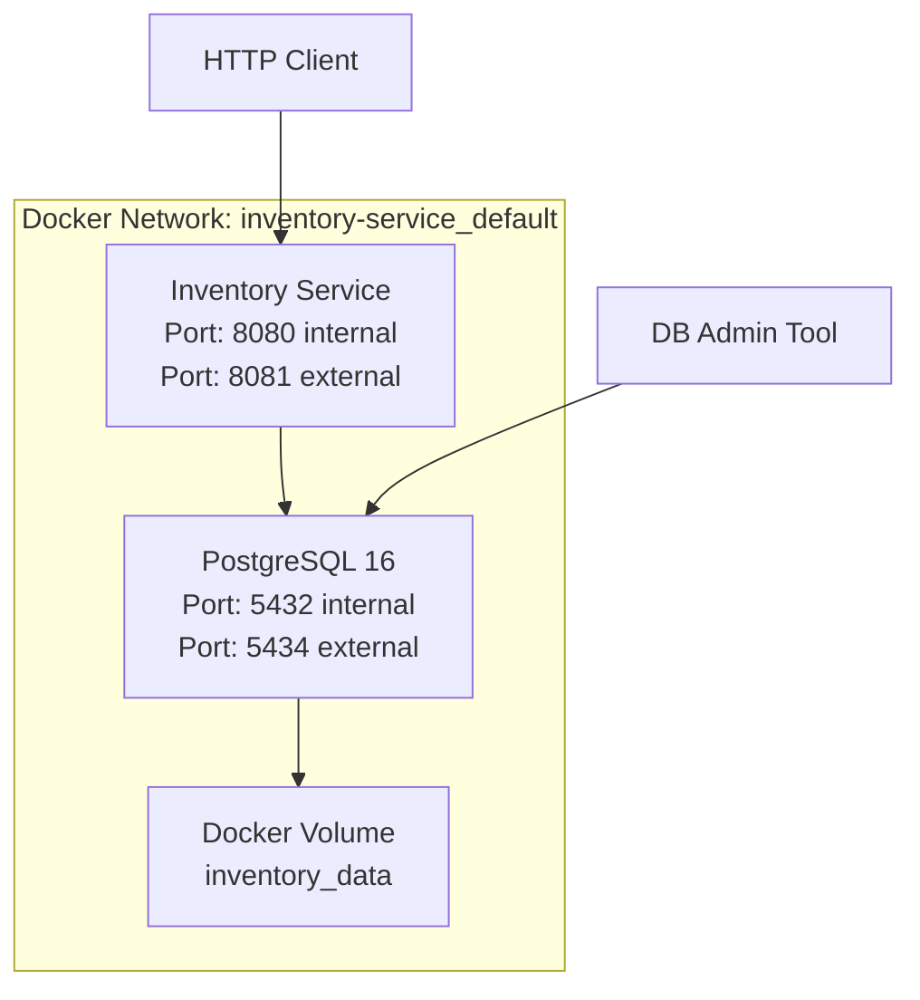

# 🐳 Docker Deployment Guide - Inventory Service

## Übersicht

Vollständige Anleitung für das Deployment des Inventory Service Mikroservices mit Docker und Docker Compose.

---

## 📋 Systemanforderungen

### Hardware

- **CPU**: Minimum 1 Core, Empfohlen 2+ Cores
- **RAM**: Minimum 2 GB, Empfohlen 4+ GB
- **Disk Space**: Minimum 5 GB freier Speicher

### Software

- **Docker**: >= 20.10.0
- **Docker Compose**: >= 2.0.0
- **OS**: Windows 10/11, macOS 10.15+, Linux (Ubuntu 18.04+)

### Ports

- **8081**: Inventory Service API
- **5434**: PostgreSQL Datenbank (extern)
- **5432**: PostgreSQL Datenbank (intern)

---

## 🏗️ Container Architektur



---

## 🚀 Quick Start

### 1. Standard Deployment

```bash
# 1. Verzeichnis wechseln
cd inventory-service

# 2. Services starten (detached mode)
docker compose up -d --build

# 3. Status prüfen
docker compose ps

# 4. Logs anzeigen
docker compose logs -f

# 5. API testen
curl http://localhost:8081/api/inventory
```

### 2. Development Mode

```bash
# Services mit Live-Logs starten
docker compose up --build

# In separatem Terminal: API testen
curl http://localhost:8081/api/inventory
```

---

## ⚙️ docker-compose.yml Referenz

```yaml
services:
  inventoryservice:
    build: . # Build aus aktuellem Verzeichnis
    container_name: inventoryservice # Fester Container-Name
    ports:
      - "8081:8080" # Port-Mapping (Host:Container)
    environment:
      - ASPNETCORE_ENVIRONMENT=Development # Umgebung
      - ConnectionStrings__DefaultConnection=Host=db-inventory;Database=inventorydb;Username=postgres;Password=postgres
    depends_on:
      db-inventory:
        condition: service_healthy # Warte auf gesunde DB
    restart: unless-stopped # Auto-Restart Policy

  db-inventory:
    image: postgres:16 # Offizielle PostgreSQL 16
    container_name: db-inventory # Fester Container-Name
    restart: always # Immer neustarten
    environment:
      POSTGRES_USER: postgres # DB-Benutzer
      POSTGRES_PASSWORD: postgres # DB-Passwort
      POSTGRES_DB: inventorydb # DB-Name
    volumes:
      - inventory_data:/var/lib/postgresql/data # Persistente Daten
    ports:
      - "5434:5432" # Externer Zugriff (optional)
    healthcheck:
      test: ["CMD-SHELL", "pg_isready -U postgres -d inventorydb"]
      interval: 5s # Alle 5 Sekunden prüfen
      timeout: 5s # 5 Sekunden Timeout
      retries: 5 # 5 Versuche

volumes:
  inventory_data: # Benanntes Volume für DB-Daten
    driver: local
```

---

## 🔧 Konfiguration

### Umgebungsvariablen

#### Inventory Service Container

| Variable                               | Wert                       | Beschreibung        |
| -------------------------------------- | -------------------------- | ------------------- |
| `ASPNETCORE_ENVIRONMENT`               | `Development`/`Production` | Umgebungsmodus      |
| `ConnectionStrings__DefaultConnection` | Siehe unten                | Datenbankverbindung |
| `ASPNETCORE_URLS`                      | `http://+:8080`            | Binding URLs        |

#### PostgreSQL Container

| Variable            | Wert          | Beschreibung    |
| ------------------- | ------------- | --------------- |
| `POSTGRES_USER`     | `postgres`    | DB-Benutzername |
| `POSTGRES_PASSWORD` | `postgres`    | DB-Passwort     |
| `POSTGRES_DB`       | `inventorydb` | Datenbankname   |

### Connection String Format

```
Host=db-inventory;Database=inventorydb;Username=postgres;Password=postgres;Port=5432
```

---

## 📦 Build Process

### Multi-Stage Dockerfile

```dockerfile
# Build Stage
FROM mcr.microsoft.com/dotnet/sdk:8.0 AS build
WORKDIR /src
COPY ["inventory-service/inventory-service.csproj", "inventory-service/"]
RUN dotnet restore "./inventory-service/inventory-service.csproj"
COPY . .
WORKDIR "/src/inventory-service"
RUN dotnet build "./inventory-service.csproj" -c Release -o /app/build
RUN dotnet publish "./inventory-service.csproj" -c Release -o /app/publish

# Runtime Stage
FROM mcr.microsoft.com/dotnet/aspnet:8.0 AS final
WORKDIR /app
EXPOSE 8080
COPY --from=build /app/publish .
ENTRYPOINT ["dotnet", "inventory-service.dll"]
```

### Build Commands

```bash
# Manueller Build
docker build -t inventory-service:latest .

# Mit spezifischem Tag
docker build -t inventory-service:1.0.0 .

# Force Rebuild (ohne Cache)
docker build --no-cache -t inventory-service:latest .
```

---

## 🔍 Monitoring & Debugging

### Container Status

```bash
# Alle Container anzeigen
docker compose ps

# Container-Details
docker compose ps --services

# Port-Mappings
docker compose port inventoryservice 8080
```

### Logs

```bash
# Alle Service-Logs
docker compose logs

# Spezifischer Service
docker compose logs inventoryservice
docker compose logs db-inventory

# Live-Logs verfolgen
docker compose logs -f inventoryservice

# Letzte 50 Zeilen
docker compose logs --tail=50 inventoryservice

# Logs mit Zeitstempel
docker compose logs -t inventoryservice
```

### Container-Zugriff

```bash
# Shell in Container
docker compose exec inventoryservice /bin/bash

# PostgreSQL-Client
docker compose exec db-inventory psql -U postgres -d inventorydb

# Dateisystem erkunden
docker compose exec inventoryservice ls -la /app
```

### Ressourcenverbrauch

```bash
# Live Resource-Monitor
docker stats

# Container-Größen
docker images | grep inventory

# Volume-Nutzung
docker system df
```

---

## 🔧 Wartung

### Updates

```bash
# Neueste Images ziehen
docker compose pull

# Services mit neuen Images neustarten
docker compose up -d --build

# Einzelnen Service updaten
docker compose up -d --no-deps inventoryservice
```

### Backup & Restore

#### Datenbank Backup

```bash
# Backup erstellen
docker compose exec db-inventory pg_dump -U postgres inventorydb > backup.sql

# Mit Docker-Volume
docker run --rm -v inventory-service_inventory_data:/data -v $(pwd):/backup alpine tar czf /backup/backup.tar.gz /data
```

#### Datenbank Restore

```bash
# Aus SQL-Datei
docker compose exec -T db-inventory psql -U postgres inventorydb < backup.sql

# Volume restore
docker run --rm -v inventory-service_inventory_data:/data -v $(pwd):/backup alpine sh -c "cd /data && tar xzf /backup/backup.tar.gz --strip 1"
```

### Cleanup

```bash
# Services stoppen und entfernen
docker compose down

# Mit Volumes
docker compose down -v

# Mit Images
docker compose down --rmi all

# System-wide cleanup
docker system prune -a
```

---

## 🛡️ Sicherheit

### Produktions-Konfiguration

#### Sichere Secrets

```yaml
# .env Datei verwenden
environment:
  - POSTGRES_PASSWORD=${DB_PASSWORD}
  - ConnectionStrings__DefaultConnection=Host=db-inventory;Database=inventorydb;Username=postgres;Password=${DB_PASSWORD}
```

#### Network Isolation

```yaml
networks:
  inventory-network:
    driver: bridge
    internal: true # Kein Internet-Zugriff

services:
  inventoryservice:
    networks:
      - inventory-network
  db-inventory:
    networks:
      - inventory-network
    ports: [] # Keine externen Ports
```

#### Resource Limits

```yaml
services:
  inventoryservice:
    deploy:
      resources:
        limits:
          memory: 512M
          cpus: "0.5"
        reservations:
          memory: 256M
          cpus: "0.25"
```

### SSL/TLS Konfiguration

```yaml
services:
  inventoryservice:
    environment:
      - ASPNETCORE_URLS=https://+:443;http://+:80
      - ASPNETCORE_Kestrel__Certificates__Default__Path=/certs/cert.pfx
      - ASPNETCORE_Kestrel__Certificates__Default__Password=${CERT_PASSWORD}
    volumes:
      - ./certs:/certs:ro
    ports:
      - "443:443"
      - "80:80"
```

---

## 🚨 Troubleshooting

### Häufige Probleme

#### 1. Port bereits belegt

**Symptom:**

```
Error starting userland proxy: listen tcp4 0.0.0.0:8081: bind: address already in use
```

**Lösung:**

```bash
# Verwendete Ports prüfen
netstat -tulpn | grep :8081

# Oder anderen Port verwenden
ports:
  - "8082:8080"
```

#### 2. Datenbank-Verbindung fehlgeschlagen

**Symptom:**

```
Failed to connect to 172.18.0.2:5432
```

**Diagnose:**

```bash
# Container-Netzwerk prüfen
docker network ls
docker network inspect inventory-service_default

# DB Health-Check
docker compose exec db-inventory pg_isready -U postgres
```

**Lösung:**

```bash
# Services neustarten
docker compose restart

# Oder vollständiger Reset
docker compose down && docker compose up -d
```

#### 3. Container startet nicht

**Symptom:**

```
Container exits with code 1
```

**Diagnose:**

```bash
# Detaillierte Logs
docker compose logs inventoryservice

# Container-Events
docker events --filter container=inventoryservice

# Manueller Container-Start für Debug
docker run -it --rm inventory-service:latest /bin/bash
```

#### 4. Speicherplatz-Probleme

**Symptom:**

```
No space left on device
```

**Lösung:**

```bash
# Docker-Cleanup
docker system prune -a

# Volume-Größen prüfen
docker system df

# Große Volumes entfernen
docker volume prune
```

### Debug-Modus

```yaml
# docker-compose.debug.yml
services:
  inventoryservice:
    build:
      context: .
      dockerfile: Dockerfile.debug
    environment:
      - ASPNETCORE_ENVIRONMENT=Development
      - DOTNET_USE_POLLING_FILE_WATCHER=true
    volumes:
      - .:/app/src:ro
    ports:
      - "8081:8080"
      - "5000:5000" # Debug-Port
```

---

## 📊 Performance Tuning

### Container-Optimierung

```yaml
services:
  inventoryservice:
    deploy:
      resources:
        limits:
          memory: 1G
          cpus: "1.0"
    ulimits:
      nproc: 65535
      nofile:
        soft: 65535
        hard: 65535
```

### Datenbank-Optimierung

```yaml
services:
  db-inventory:
    environment:
      - POSTGRES_SHARED_PRELOAD_LIBRARIES=pg_stat_statements
      - POSTGRES_MAX_CONNECTIONS=200
      - POSTGRES_SHARED_BUFFERS=256MB
      - POSTGRES_EFFECTIVE_CACHE_SIZE=1GB
```

### Health Checks

```yaml
services:
  inventoryservice:
    healthcheck:
      test: ["CMD", "curl", "-f", "http://localhost:8080/health"]
      interval: 30s
      timeout: 10s
      retries: 3
      start_period: 60s
```

---

## 🌐 Reverse Proxy Setup

### Nginx Konfiguration

```nginx
upstream inventory_service {
    server localhost:8081;
}

server {
    listen 80;
    server_name inventory.example.com;

    location /api/inventory {
        proxy_pass http://inventory_service;
        proxy_set_header Host $host;
        proxy_set_header X-Real-IP $remote_addr;
        proxy_set_header X-Forwarded-For $proxy_add_x_forwarded_for;
        proxy_set_header X-Forwarded-Proto $scheme;
    }
}
```

### Traefik Labels

```yaml
services:
  inventoryservice:
    labels:
      - "traefik.enable=true"
      - "traefik.http.routers.inventory.rule=Host(`inventory.example.com`)"
      - "traefik.http.routers.inventory.entrypoints=websecure"
      - "traefik.http.services.inventory.loadbalancer.server.port=8080"
```

---

## 📈 Scaling

### Horizontale Skalierung

```yaml
services:
  inventoryservice:
    deploy:
      replicas: 3
    ports:
      - "8081-8083:8080"
```

### Load Balancer

```yaml
version: "3.8"
services:
  nginx-lb:
    image: nginx:alpine
    ports:
      - "80:80"
    volumes:
      - ./nginx.conf:/etc/nginx/nginx.conf
    depends_on:
      - inventoryservice

  inventoryservice:
    deploy:
      replicas: 3
```

---

**🎯 Status**: ✅ **Produktionsbereit**  
**📅 Letzte Aktualisierung**: 28. Oktober 2025  
**🏷️ Docker Version**: 1.0.0
